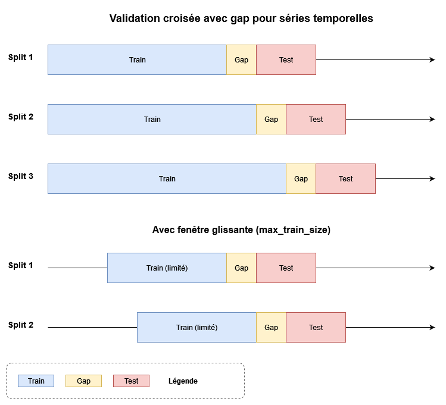

# Cross-validation temporelle

## Le problème

La validation croisée classique (`KFold`) mélange les observations au hasard. Sur
une série temporelle, cela revient à entraîner un modèle sur le futur pour
prédire le passé : les scores obtenus sont optimistes et ne disent rien de la
performance réelle en production.

`tsforecast.crossvals` fournit des *splitters* qui respectent l'ordre temporel :
l'entraînement précède toujours le test, et un intervalle (`gap`) peut être
imposé entre les deux pour reproduire un délai de prévision.

## Deux familles

| Famille | Le test est… | Usage |
|---------|--------------|-------|
| **Out-of-sample** (`OutOfSampleSplit`, `TSOutOfSampleSplit`, `PanelOutOfSampleSplit`) | exclu de l'entraînement | estimer la performance de prévision réelle |
| **In-sample** (`InSampleSplit`, `TSInSampleSplit`, `PanelInSampleSplit`) | inclus dans l'entraînement | évaluer un ajustement historique (backcast, *nowcasting* révisé) |

Chaque famille se décline pour :

- une **série temporelle** unique — index `DatetimeIndex` ;
- un **panel** — `MultiIndex (entité..., date)`, avec deux variantes :
    - `Panel*Split` : un découpage global, la même fenêtre de test pour toutes
      les entités ;
    - `Panel*SplitPerEntity` : un découpage propre à chaque entité.

## Paramètres clés

Tous les splitters partagent l'API de `OutOfSampleSplit` :

- `n_splits` : nombre de plis (défaut 5) ;
- `test_size` : taille de chaque ensemble de test ;
- `gap` : nombre de périodes ignorées entre entraînement et test — c'est le
  levier anti-fuite. Un modèle qui prédit à horizon *h* doit être évalué avec
  `gap = h` ;
- `max_train_size` : plafond de la fenêtre d'entraînement (fenêtre glissante
  plutôt qu'extensible) ;
- `test_indices` : dates de test explicites, au lieu des dernières portions.



## Compatibilité scikit-learn

Les splitters implémentent `split(X, y=None, groups=None)` et `get_n_splits()`.
Ils s'utilisent donc directement partout où sklearn attend un `cv` :

```python
from sklearn.model_selection import cross_validate, GridSearchCV
from tsforecast.crossvals import TSOutOfSampleSplit

cv = TSOutOfSampleSplit(n_splits=5, test_size=6, gap=1)
cross_validate(estimator, X, y, cv=cv, scoring="neg_root_mean_squared_error")
GridSearchCV(estimator, param_grid, cv=cv)
```

Pour un panel, passer `groups` (les identifiants d'entité) ou laisser le splitter
les extraire du `MultiIndex`.

## Pour aller plus loin

- Tutoriel : [Ensembles train/test rigoureux](../tutorials/pseudo_real_time_forecast.md)
- API : [OutOfSampleSplit](../api/crossvals/OutOfSampleSplit.md),
  [TSOutOfSampleSplit](../api/crossvals/TSOutOfSampleSplit.md),
  [PanelOutOfSampleSplit](../api/crossvals/PanelOutOfSampleSplit.md)
- Résumé des plis pour le tracking :
  [`split_summary`](../guides/mlflow_tracking.md)
