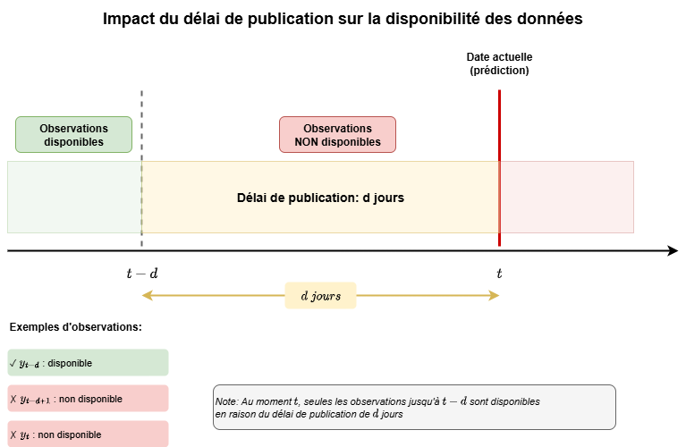
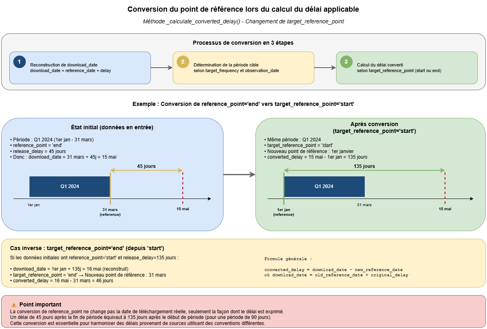
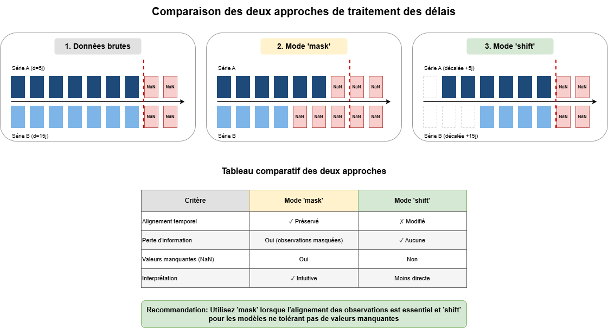

# Délais de publication

## Le problème

Une observation datée du 1ᵉʳ janvier n'est pas forcément *connue* le 1ᵉʳ janvier.
Le PIB d'un trimestre est publié 45 jours après sa fin ; un indice mensuel, deux
semaines après. Si l'on entraîne et évalue un modèle sur des données « telles
qu'elles existent aujourd'hui », on lui donne accès à une information qu'il
n'aurait pas eue en temps réel — c'est une fuite.

`tsforecast.delays` sert à **reconstruire l'état de l'information à une date de
prévision donnée** : quelles valeurs étaient publiées, lesquelles ne l'étaient
pas encore.

## Vocabulaire

- **Délai de publication (*publication lag*)** : temps entre la période couverte
  par une observation et sa mise à disposition.
- **Point de référence (`reference_point`)** : le délai se compte-t-il depuis le
  **début** (`'start'`) ou la **fin** (`'end'`) de la période ? La convention du
  package : la date en index désigne toujours le **début** de la période.
- **Date de prévision (`prediction_date`)** : la date à laquelle on se place pour
  décider ce qui est connu.

## Trois briques

### 1. Inférer les délais — `compare_and_detect_delays()`

À partir de deux extractions datées d'un même jeu de données (ou d'une seule :
la dernière observation de chaque variable est alors retenue), la fonction déduit
le délai observé par variable et par observation. Deux modes : `new_only`
(nouvelles valeurs) et `all_changes` (révisions comprises). Le délai se compte
toujours depuis le même point de la période (`reference_point`), quel que soit le
mode : le délai entre la première publication et une révision s'obtient par
différence entre les deux résultats.

### 2. Calculer le délai applicable — `calculate_applicable_delay()`

Convertit un délai d'une fréquence / d'un point de référence à un autre (ex.
« 45 jours depuis la fin du trimestre » → « n mois depuis le début »), en
sélectionnant la sous-période qui contient la date d'observation.

### 3. Appliquer / inverser — `PublicationDelayTransformer`

Transformateur sklearn (réversible) qui, connaissant les délais et la
`prediction_date`, ré-exprime le jeu de données comme il était connu à cette
date. Deux stratégies :

| Stratégie | Effet | Quand |
|-----------|-------|-------|
| `mask` | met à `NaN` les valeurs non encore publiées, laisse les dates en place | conserver l'acquis, gérer les trous en aval |
| `shift` | décale chaque série de son délai (la valeur de *t* apparaît à *t + délai*) | aligner toutes les séries sur ce qui est réellement disponible à chaque ligne |

Les stratégies sont configurables par variable (`strategy={'gdp': 'shift',
'cpi': 'mask'}`). En interne, sur un panel, le transformateur s'enveloppe
automatiquement dans un [`PanelwiseTransformer`](panelwise_transforms.md) ; les
briques bas niveau `ShiftTransformer` et `MaskTransformer` restent accessibles.

## Observabilité : rapports de détection et d'ajustement

Pour une utilisation en production, deux rapports immuables rassemblent ce qu'on
voudrait logger (dans des logs ou dans MLflow) :

- `compare_and_detect_delays(..., return_report=True)` renvoie `(délais, rapport)`
  avec un `DelayDetectionReport` : colonnes comparées / ignorées, observations
  nouvelles, révisées et **disparues** (non nulles avant, `NaN` maintenant :
  jamais reportées par la fonction), fréquences détectées (et non détectées),
  statistiques des délais ;
- `PublicationDelayTransformer.fit_report_` (`DelayFitReport`) : paramétrage résolu
  de chaque colonne et **origine** de chaque paramètre (explicite, inféré,
  par défaut), colonnes non affectées ou ignorées, valeurs par défaut imputées,
  replis du masquage vers le décalage.

Chaque rapport se rend en une ligne (`summary()`), en dictionnaire compatible JSON
(`to_dict()`) et en `DataFrame` (`to_frame()`). Les métriques plates sont produites
par `detection_metrics()` et `delay_metrics()` ; les deux composants écrivent aussi
`report.summary()` au niveau `INFO` du logger standard
(`tsforecast.delays.data_manager`, `tsforecast.delays.transformers`) — aucun handler
n'est configuré par le paquet. Voir le [guide de tracking](../guides/mlflow_tracking.md).

## Pour aller plus loin

- Tutoriel : [Délais de publication](../tutorials/publication_delays.md)
- API : [PublicationDelayTransformer](../api/delays/PublicationDelayTransformer.md),
  [compare_and_detect_delays](../api/delays/compare_and_detect_delays.md),
  [calculate_applicable_delay](../api/delays/calculate_applicable_delay.md),
  [rapports](../api/delays/report.md)
- Métriques de tracking : [`delay_metrics`, `detection_metrics`](../guides/mlflow_tracking.md)
