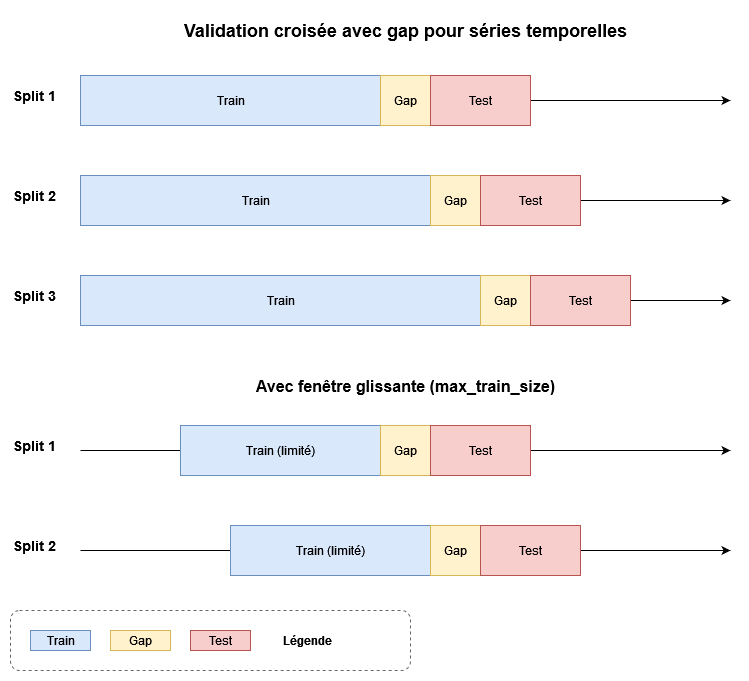

# Tutoriel : Définition rigoureuse des ensembles d'entraînement et de test pour la prévision

## Introduction

Lors de la construction de modèles de prévision pour des séries temporelles ou des données de panel, la définition correcte des ensembles d'entraînement et de test est **cruciale** pour éviter le *data leakage* et obtenir des évaluations réalistes de la performance. Ce tutoriel explique comment utiliser le paramètre `gap` dans les classes de validation croisée `tsforecast.crossvals` à ces fins.

## 1. Concepts fondamentaux

### 1.1 L'alignement des données dans la prévision

Pour prédire une variable $y$ à un horizon $h$, il faut aligner correctement les observations et les covariables :

- **Au moment de la prédiction** : On utilise les covariables $X_t$ pour prédire $y_{t+h}$
- **Pour l'entraînement** : On aligne $X_{t-h}$ avec $y_t$ 


**Point clé** : Pour entraîner un modèle jusqu'au temps $t$, on ne peut utiliser que les données allant antérieures à la paire $(X_{t-h}, y_t)$ car $y$ doit être observé pour l'entraînement.

### 1.2 Impact du délai de publication

En pratique, les données cibles $y$ peuvent avoir un **délai de publication**[^1]. Par exemple :
- Les données économiques sont souvent publiées avec 1-3 mois de retard
- Les rapports financiers sont disponibles plusieurs semaines après la fin du trimestre


Avec un délai de publication $d$, au temps $t$ nous n'avons accès qu'à $y_{t-d}$. Donc :
- La dernière observation utilisable pour l'entraînement est $y_{t-d}$
- Qui s'aligne avec $X_{t-d-h}$

**Règle importante** : L'écart nécessaire entre les données d'entraînement et de test est la somme du le délai de publication de la variable cible : $\text{gap} = d$

[^1]: Les covariables $X$ peuvent également avoir des délais de publication mais ces-derniers sont facilement traitables, sans occasionner de *data leakage* en utilisant des valeurs plus anciennes.

## 2. Utilisation pratique avec `tsforecast.crossvals`

### 2.1 Configuration de base pour séries temporelles

```python
import pandas as pd
import numpy as np
from tsforecast.crossvals import TSOutOfSampleSplit

# Création de données exemple
dates = pd.date_range('2020-01-01', periods=365, freq='D')
X = pd.DataFrame({
    'feature_1': np.random.randn(365),
    'feature_2': np.random.randn(365)
}, index=dates)
y = pd.Series(np.random.randn(365), index=dates, name='target')

# Scénario 1 : Prévision à horizon h=5 jours sans délai
h = 5
splitter = TSOutOfSampleSplit(
    n_splits=3,
    test_size=20,  # 20 jours de test
    gap=h          # gap = horizon
)

# Validation croisée
for i, (train_idx, test_idx) in enumerate(splitter.split(X)):
    X_train, X_test = X.iloc[train_idx], X.iloc[test_idx]
    y_train = y.iloc[train_idx + h]  # Alignement pour l'entraînement
    y_test = y.iloc[test_idx + h]    # Alignement pour le test
    
    print(f"\nSplit {i+1}:")
    print(f"  Train: {X_train.index[0].date()} → {X_train.index[-1].date()}")
    print(f"  Test:  {X_test.index[0].date()} → {X_test.index[-1].date()}")
    print(f"  Gap de {h} jours respecté")
```

### 2.2 Gestion du délai de publication

```python
# Scénario 2 : Prévision avec délai de publication
h = 5        # Horizon de prévision
delay = 7    # Délai de publication de 7 jours

splitter = TSOutOfSampleSplit(
    n_splits=3,
    test_size=20,
    gap=h+delay  # Utilisation du delay
)

# Application
for i, (train_idx, test_idx) in enumerate(splitter.split(X)):
    X_train, X_test = X.iloc[train_idx], X.iloc[test_idx]
    y_train = y.iloc[train_idx + h]  # Alignement pour l'entraînement : X_{t-delay-h} ↔ y_{t-delay}
    y_test = y.iloc[test_idx + h]    # Alignement pour le test : X_t → y_{t+h}
    
    
    print(f"\nSplit {i+1} avec delay={delay}, h={h}:")
    print(f"  Dernière observation y disponible pour train: {y_train.index[-1].date()}")
    print(f"  Première prédiction à faire: {y_test.index[0].date()}")
    print(f"  Gap effectif: {(y_test.index[0] - y_train.index[-1]).days} jours")
```

### 2.3 Validation croisée avec fenêtre glissante

Pour les longues séries temporelles, utiliser une fenêtre d'entraînement limitée peut améliorer la performance :

```python
# Scénario 3 : Fenêtre glissante (rolling window)
splitter = TSOutOfSampleSplit(
    n_splits=5,
    test_size=30,
    gap=5,
    max_train_size=180  # Fenêtre de 6 mois
)

results = []
for train_idx, test_idx in splitter.split(X):
    X_train, X_test = X.iloc[train_idx], X.iloc[test_idx]
    
    # Entraînement du modèle (exemple avec régression linéaire)
    from sklearn.linear_model import LinearRegression
    model = LinearRegression()
    
    # Alignement simple pour h=5
    y_train_aligned = y.iloc[train_idx + 5]
    model.fit(X_train, y_train_aligned)
    
    # Prédiction
    y_pred = model.predict(X_test)
    
    results.append({
        'train_start': X_train.index[0],
        'train_end': X_train.index[-1],
        'test_start': X_test.index[0],
        'test_end': X_test.index[-1],
        'train_size': len(X_train),
        'predictions': y_pred
    })

# Affichage du résumé
import pandas as pd
results_df = pd.DataFrame(results)
print("\nRésumé de la validation croisée avec fenêtre glissante:")
print(results_df[['train_start', 'train_end', 'test_start', 'train_size']])
```



## 3. Application aux données de panel

Pour les données de panel (multi-entités), les mêmes principes s'appliquent à chaque entité :

```python
from tsforecast.crossvals import PanelOutOfSampleSplit

# Création de données panel
entities = ['AAPL', 'GOOGL', 'MSFT', 'AMZN']
dates = pd.date_range('2020-01-01', periods=252, freq='D')  # 1 an de trading
index = pd.MultiIndex.from_product([entities, dates], names=['entity', 'date'])

# Features et target
panel_X = pd.DataFrame({
    'return_lag1': np.random.randn(len(index)),
    'volume': np.random.exponential(1e6, len(index)),
    'volatility': np.random.exponential(0.02, len(index))
}, index=index)

panel_y = pd.Series(np.random.randn(len(index)), index=index, name='return')

# Configuration pour prévision à 5 jours avec délai de 1 jour
h = 5
delay = 1

splitter = PanelOutOfSampleSplit(
    test_indices=['2020-06-01', '2020-09-01', '2020-12-01'],
    test_size=20,
    gap=h+delay
)

# Validation pour chaque split
for split_num, (train_idx, test_idx) in enumerate(splitter.split(panel_X)):
    print(f"\n=== Split {split_num + 1} ===")
    
    # Analyse par entité
    for entity in entities:
        # Extraction des données de l'entité
        entity_train_mask = panel_X.iloc[train_idx].index.get_level_values(0) == entity
        entity_test_mask = panel_X.iloc[test_idx].index.get_level_values(0) == entity
        
        if entity_train_mask.any() and entity_test_mask.any():
            entity_train_dates = panel_X.iloc[train_idx][entity_train_mask].index.get_level_values(1)
            entity_test_dates = panel_X.iloc[test_idx][entity_test_mask].index.get_level_values(1)
            
            print(f"\n  {entity}:")
            print(f"    Train: {entity_train_dates[0].date()} → {entity_train_dates[-1].date()}")
            print(f"    Test:  {entity_test_dates[0].date()} → {entity_test_dates[-1].date()}")
            print(f"    Gap: {(entity_test_dates[0] - entity_train_dates[-1]).days} jours")
```

## 4. Procédure algorithmique complète

Voici la procédure complète pour configurer correctement la validation croisée :


## 5. Erreurs courantes à éviter

### ❌ Erreur 1 : Ignorer le délai de publication
```python
# INCORRECT : Ne considère que l'horizon
splitter = TSOutOfSampleSplit(gap=h)  # Oublie le delay!
```

### ✅ Correction :
```python
# CORRECT : Prend en compte horizon ET délai
splitter = TSOutOfSampleSplit(gap=h+ delay)
```

### ❌ Erreur 2 : Mauvais alignement des données
```python
# INCORRECT : Utilise les mêmes indices pour X et y
y_train = y.iloc[train_idx]  # Pas d'alignement!
```

### ✅ Correction :
```python
# CORRECT : Aligne correctement X et y
y_train = y.iloc[train_idx + h]  # Alignement correct
```

### ❌ Erreur 3 : Utiliser des données futures
```python
# INCORRECT : Inclut des observations futures dans les features
X_with_future = create_features_with_future_info(data)
```

### ✅ Correction :
```python
# CORRECT : Utilise seulement l'information passée
X_valid = create_features_using_past_only(data)
```

## 6. Exemple complet : Prévision de ventes avec saisonnalité

```python
# Génération de données de ventes avec tendance et saisonnalité
np.random.seed(42)
dates = pd.date_range('2018-01-01', periods=365*3, freq='D')

# Composantes du signal
trend = np.linspace(100, 150, len(dates))
seasonal = 10 * np.sin(2 * np.pi * np.arange(len(dates)) / 365.25)
noise = np.random.normal(0, 5, len(dates))
sales = trend + seasonal + noise

# DataFrame avec features
data = pd.DataFrame({
    'sales': sales,
    'day_of_week': dates.dayofweek,
    'month': dates.month,
    'day_of_year': dates.dayofyear,
    'trend': np.arange(len(dates))
}, index=dates)

# Ajout de features retardées
for lag in [1, 7, 14, 30]:
    data[f'sales_lag_{lag}'] = data['sales'].shift(lag)

# Suppression des NaN dus aux lags
data = data.dropna()

# Configuration pour prévision à 7 jours avec délai de 2 jours
h = 7
delay = 2
gap = h + delay  # gap =9

# Séparation features/target
feature_cols = [col for col in data.columns if col != 'sales']
X = data[feature_cols]
y = data['sales']

# Validation croisée avec dates spécifiques
test_dates = pd.date_range('2020-01-01', '2020-12-01', freq='MS')
splitter = TSOutOfSampleSplit(
    test_indices=test_dates,
    test_size=30,  # 30 jours de test
    gap=gap,
    max_train_size=365  # Fenêtre d'un an
)

# Évaluation
from sklearn.ensemble import RandomForestRegressor
from sklearn.metrics import mean_absolute_error, mean_squared_error

results = []
for i, (train_idx, test_idx) in enumerate(splitter.split(X)):
    # Alignement des données
    X_train = X.iloc[train_idx]
    X_test = X.iloc[test_idx]
    
    # Alignement correct de y
    y_train_idx = [idx + h for idx in train_idx if idx + h < len(y)]
    y_test_idx = [idx + h for idx in test_idx if idx + h < len(y)]
    
    y_train = y.iloc[y_train_idx]
    y_test = y.iloc[y_test_idx]
    
    # Ajustement des tailles si nécessaire
    min_len_train = min(len(X_train), len(y_train))
    X_train = X_train.iloc[:min_len_train]
    y_train = y_train.iloc[:min_len_train]
    
    min_len_test = min(len(X_test), len(y_test))
    X_test = X_test.iloc[:min_len_test]
    y_test = y_test.iloc[:min_len_test]
    
    # Modèle
    model = RandomForestRegressor(n_estimators=100, random_state=42)
    model.fit(X_train, y_train)
    
    # Prédictions
    y_pred = model.predict(X_test)
    
    # Métriques
    mae = mean_absolute_error(y_test, y_pred)
    rmse = np.sqrt(mean_squared_error(y_test, y_pred))
    
    results.append({
        'split': i + 1,
        'test_start': X_test.index[0],
        'test_end': X_test.index[-1],
        'mae': mae,
        'rmse': rmse,
        'train_size': len(X_train)
    })
    
    print(f"\nSplit {i+1}:")
    print(f"  Test: {X_test.index[0].date()} → {X_test.index[-1].date()}")
    print(f"  MAE: {mae:.2f}, RMSE: {rmse:.2f}")

# Résumé des performances
results_df = pd.DataFrame(results)
print("\n=== Résumé des performances ===")
print(f"MAE moyen: {results_df['mae'].mean():.2f} ± {results_df['mae'].std():.2f}")
print(f"RMSE moyen: {results_df['rmse'].mean():.2f} ± {results_df['rmse'].std():.2f}")
```

## Conclusion

La définition rigoureuse des ensembles d'entraînement et de test est essentielle pour :

1. **Éviter le data leakage** : En respectant l'ordre temporel et les contraintes d'information
2. **Obtenir des évaluations réalistes** : En simulant les conditions réelles de prédiction
3. **Gérer les contraintes pratiques** : Délais de publication, horizons multiples, etc.

Le paramètre `gap` dans `tsforecast.crossvals` permet de gérer ces contraintes de manière systématique :
- `gap = h` pour une prévision simple à horizon h
- `gap = delay + h` quand il y a un délai de publication

Cette approche garantit que les modèles sont évalués dans des conditions qui reflètent leur utilisation en production.