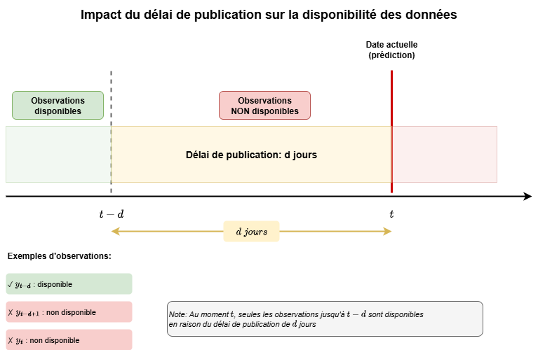
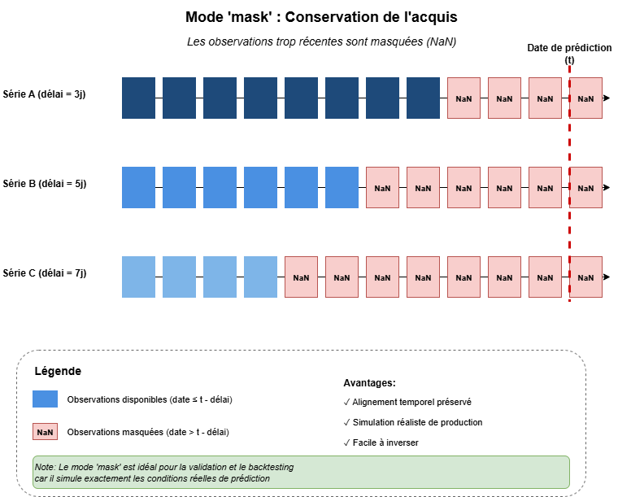
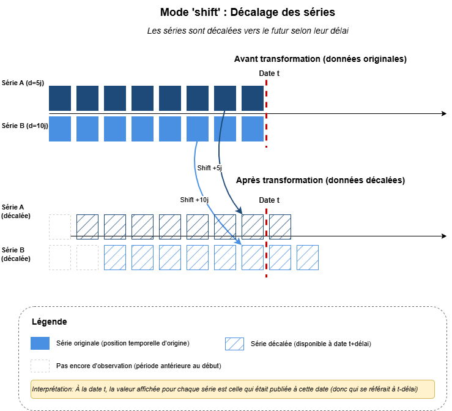
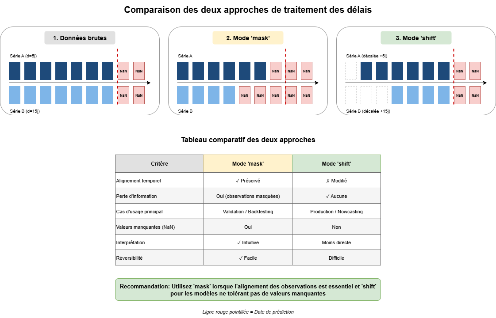

# Tutoriel : Traitement des délais de publication en prévision

## Introduction

Les **délais de publication** (ou *release delays*) des variables utilisées pour construire un modèle de prévision sur séries temporelles constituent un écueil majeur dont il faut tenir compte pour simuler justement la performance prédictive de modèles en production. En pratique, les données économiques, financières ou opérationnelles ne sont en effet pas disponibles instantanément : elles sont publiées avec un retard qui peut aller de quelques jours à plusieurs mois. Ignorer ces délais lors de l'entraînement et de l'évaluation des modèles conduit à une surestimation systématique des performances.

Ce tutoriel présente deux approches complémentaires pour gérer ces délais : la **conservation de l'acquis** et le **décalage des séries**.

## 1. Comprendre les délais de publication

### 1.1 Qu'est-ce qu'un délai de publication ?

Le délai de publication est le temps qui s'écoule entre :
- La fin de la période de référence d'une observation
- Le moment où cette observation devient disponible

**Exemples** :
- Le PIB du T1 2024 (janvier-mars) est publié fin avril → délai de ~30 jours
- Les ventes d'un magasin du 15 janvier sont consolidées le 18 janvier → délai de 3 jours
- Le taux de chômage de septembre est publié début octobre → délai de ~7 jours

### 1.2 Impact sur la prévision

Au moment de faire une prévision à la date $t$, nous disposons uniquement des observations publiées avant $t$. Pour une série avec un délai de publication $d$ :

- **Dernière observation disponible** : $y_{t-d}$
- **Observations non disponibles** : $y_{t-d+1}, ..., y_{t-1}, y_t$



**Conséquence critique** : Si nous entraînons un modèle sur des données sans tenir compte des délais, nous créons un **data leakage temporel** en utilisant des informations qui ne seraient pas disponibles en production.

## 2. Deux approches pour gérer les délais

### 2.1 Vue d'ensemble

Il existe deux stratégies principales pour gérer les délais de publication, chacune avec ses avantages :

| Approche | Principe | Avantages | Cas d'usage |
|----------|----------|-----------|-------------|
| **Conservation de l'acquis** | Masquer les observations non disponibles | Préserve l'alignement temporel | Modèles à horizon fixe, validation réaliste |
| **Décalage des séries** | Shifter les séries selon leur délai | Utilise toute l'information disponible | Nowcasting, prévision immédiate |

### 2.2 Approche 1 : Conservation de l'acquis (mode `mask`)

**Principe** : On conserve l'alignement temporel original mais on remplace par `NaN` les observations qui ne seraient pas encore disponibles au moment de la prévision.



**Algorithme** :
```
Pour chaque série i avec délai d_i :
    Pour chaque date t dans les données :
        Si t > date_prédiction - d_i :
            Masquer y_i(t)  # Remplacer par NaN
```

**Exemple pratique** :
```python
import pandas as pd
import numpy as np
from tsforecast.delays import ReleaseDelayTransformer

# Données avec deux indicateurs
dates = pd.date_range('2024-01-01', periods=100, freq='D')
data = pd.DataFrame({
    'date': dates,
    'GDP': np.random.randn(100),      # Délai: 30 jours
    'inflation': np.random.randn(100)  # Délai: 7 jours
})

# Configuration des délais
delays = {'GDP': 30, 'inflation': 7}

# Application du masquage
transformer = ReleaseDelayTransformer(
    delays_dict=delays,
    mode='mask',
    prediction_date='2024-03-15',  # Date de référence
    time_col='date'
)

# Transformation
data_masked = transformer.fit_transform(data)

# Résultat :
# - GDP : masqué après 2024-02-14 (30 jours avant 2024-03-15)
# - inflation : masqué après 2024-03-08 (7 jours avant 2024-03-15)
```

**Avantages** :
- ✅ Alignement temporel préservé : `X_t` correspond toujours à la date `t`
- ✅ Simulation réaliste en production
- ✅ Facile à inverser

**Inconvénients** :
- ❌ Perte d'information (observations masquées)
- ❌ Nécessite des modèles robustes aux valeurs manquantes

### 2.3 Approche 2 : Décalage des séries (mode `shift`)

**Principe** : On décale chaque série vers le futur selon son délai de publication, de sorte que la valeur disponible à la date `t` soit alignée avec cette date.



**Algorithme** :
```
Pour chaque série i avec délai d_i :
    Shifter la série de d_i périodes vers le futur
    # y_i(t+d_i) ← y_i(t)
```

**Exemple pratique** :
```python
# Même configuration que précédemment
transformer = ReleaseDelayTransformer(
    delays_dict=delays,
    mode='shift',  # Mode décalage
    prediction_date='2024-03-15',
    time_col='date'
)

# Transformation
data_shifted = transformer.fit_transform(data)

# Résultat :
# - GDP de date t apparaît maintenant à t+30 jours
# - inflation de date t apparaît à t+7 jours
# → Les valeurs à la ligne du 15 mars sont celles publiées ce jour-là
```

**Avantages** :
- ✅ Aucune perte d'information
- ✅ Utilise la dernière observation disponible
- ✅ Idéal pour le nowcasting
- ✅ Pas de valeurs manquantes générées
- ✅ Permet de tenir compte des effets d'entraînement

**Inconvénients** :
- ❌ Perd l'alignement temporel naturel
- ❌ Interprétation moins intuitive
- ❌ Inversion non-parfaite

## 3. Comparaison visuelle des deux approches

### 3.1 Données brutes avant transformation

Supposons trois séries avec des délais différents :
- Série A (bleu foncé) : délai de 5 jours
- Série B (bleu clair) : délai de 15 jours

### 3.2 Après application du mode `mask`

Les observations trop récentes sont masquées (remplacées par NaN). L'alignement temporel est préservé mais certaines cellules deviennent vides.

### 3.3 Après application du mode `shift`

Les séries sont décalées vers le futur. Aucune observation n'est perdue, mais les valeurs ne correspondent plus à leur date de référence originale.



## 4. Gestion des fréquences temporelles

### 4.1 Conversion des délais à différentes fréquences

Les délais sont généralement exprimés en jours calendaires, mais les données peuvent avoir différentes fréquences (mensuelle, trimestrielle, etc.).

**Règles de conversion** :

| Fréquence cible | Méthode de conversion |
|-----------------|----------------------|
| Mensuelle | `délai_mois = round(délai_jours / 30)` |
| Trimestrielle | `délai_trimestres = round(délai_jours / 90)` |
| Hebdomadaire | `délai_semaines = round(délai_jours / 7)` |

### 4.2 Agrégation avec conservation de l'acquis

Lors de l'agrégation temporelle en mode `mask`, on calcule les statistiques sur les observations disponibles uniquement.

```python
# Exemple : agrégation mensuelle avec mode mask
data_monthly = data_masked.resample('MS', on='date').agg({
    'GDP': 'mean',        # Moyenne des valeurs non-NaN
    'inflation': 'mean'
})
```

### 4.3 Agrégation avec décalage des séries

En mode `shift`, l'agrégation se fait après le décalage. Les observations agrégées représentent les moyennes des valeurs disponibles à chaque période.

```python
# Exemple : agrégation mensuelle avec mode shift
data_monthly = data_shifted.resample('MS', on='date').agg({
    'GDP': 'mean',
    'inflation': 'mean'
})
```

## 5. Utilisation pratique avec sklearn

### 5.1 Pipeline complet

```python
from sklearn.pipeline import Pipeline
from sklearn.ensemble import RandomForestRegressor
from tsforecast.delays import ReleaseDelayTransformer

# Définition des délais (en jours)
delays = {
    'GDP': 45,
    'CPI': 30,
    'unemployment': 15,
    'retail_sales': 20
}

# Construction du pipeline
pipeline = Pipeline([
    ('delays', ReleaseDelayTransformer(
        delays_dict=delays,
        mode='mask',
        prediction_date='today',
        time_col='date'
    )),
    ('model', RandomForestRegressor(n_estimators=100))
])

# Entraînement
pipeline.fit(X_train, y_train)

# Prédiction (les délais sont automatiquement appliqués)
y_pred = pipeline.predict(X_test)
```

### 5.2 Validation croisée réaliste

Pour une évaluation réaliste, il faut combiner la gestion des délais avec un découpage temporel correct :

```python
from tsforecast.crossvals import TSOutOfSampleSplit

# Configuration de la validation croisée
splitter = TSOutOfSampleSplit(
    n_splits=5,
    test_size=30,
    gap=5  # Horizon de prévision
)

# Évaluation avec délais
results = []
for train_idx, test_idx in splitter.split(X):
    X_train = X.iloc[train_idx]
    X_test = X.iloc[test_idx]
    
    # Application des délais uniquement sur l'ensemble de test
    transformer = ReleaseDelayTransformer(
        delays_dict=delays,
        mode='mask',
        prediction_date=X_test['date'].iloc[0],  # Date du début du test
        time_col='date'
    )
    
    X_test_delayed = transformer.fit_transform(X_test)
    
    # Entraînement et évaluation
    model = RandomForestRegressor()
    model.fit(X_train, y_train)
    y_pred = model.predict(X_test_delayed)
    
    results.append(evaluate_predictions(y_test, y_pred))
```

## 6. Cas d'usage avancés

### 6.1 Délais variables par entité (données panel)

Pour les données panel, chaque entité peut avoir des délais différents :

```python
# Délais par entité et indicateur
delays_panel = {
    ('France', 'GDP'): 45,
    ('Germany', 'GDP'): 40,
    ('France', 'inflation'): 30,
    ('Germany', 'inflation'): 28
}

transformer = ReleaseDelayTransformer(
    delays_dict=delays_panel,
    mode='mask',
    prediction_date='2024-03-15',
    time_col='date',
    panel_cols=['country']  # Colonne identifiant les entités
)
```

### 6.2 Délais calculés dynamiquement

Utilisation d'un calculateur pour extraire les délais des données historiques :

```python
from tsforecast.delays import ReleaseDelayCalculator

# Données historiques de publication
publication_history = pd.DataFrame({
    'indicator': ['GDP', 'GDP', 'inflation', 'inflation'],
    'reference_date': ['2023-Q1', '2023-Q2', '2023-01', '2023-02'],
    'publication_date': ['2023-05-15', '2023-08-10', '2023-02-12', '2023-03-11']
})

# Calcul des délais médians
calculator = ReleaseDelayCalculator(delay_data=publication_history)
median_delays = calculator.calculate_median_delays(reference_point='end')

# Utilisation dans le transformer
transformer = ReleaseDelayTransformer(
    delay_calculator=calculator,
    mode='mask',
    prediction_date='today'
)
```

### 6.3 Mise à jour dynamique des délais

```python
# Création du transformer
transformer = ReleaseDelayTransformer(
    delays_dict={'GDP': 45, 'inflation': 30},
    mode='mask',
    prediction_date='2024-03-15'
)

# Fit initial
transformer.fit(X)

# Mise à jour des délais après obtention de nouvelles informations
new_delays = {'GDP': 42, 'retail_sales': 25}  # Délai GDP révisé
transformer.update_delays(new_delays)

# Les transformations suivantes utiliseront les délais mis à jour
X_transformed = transformer.transform(X_new)
```

## 7. Choix de la méthode appropriée

### 7.1 Arbre de décision

```
Quel est votre objectif ?
│
├─ Validation réaliste / Backtesting
│  └─ Mode 'mask' (conservation de l'acquis)
│     → Simule exactement les conditions de production
│
├─ Prévision immédiate / Nowcasting
│  └─ Mode 'shift' (décalage des séries)
│     → Utilise toute l'information disponible
│
├─ Modèle sensible aux valeurs manquantes
│  └─ Mode 'shift' ou imputation + 'mask'
│
└─ Interprétabilité importante
   └─ Mode 'mask' (alignement temporel préservé)
```

### 7.2 Recommandations par contexte

| Contexte | Méthode recommandée | Justification |
|----------|---------------------|---------------|
| Validation de modèle | `mask` | Évaluation réaliste |
| Production (prévision à J) | `shift` | Utilise les dernières données |
| Analyse exploratoire | `mask` | Interprétation plus intuitive |
| Modèles linéaires | Les deux | Compatibles |
| Deep learning | `shift` | Évite les NaN |
| Modèles d'arbre | Les deux | Gèrent les NaN nativement |

## 8. Erreurs courantes à éviter

### ❌ Erreur 1 : Ignorer les délais lors de l'évaluation

```python
# INCORRECT : Évalue sans tenir compte des délais
model.fit(X_train, y_train)
score = model.score(X_test, y_test)  # Surestimation !
```

✅ **Correction** :
```python
# CORRECT : Applique les délais avant l'évaluation
transformer = ReleaseDelayTransformer(delays_dict=delays, mode='mask')
X_test_real = transformer.fit_transform(X_test)
score = model.score(X_test_real, y_test)
```

### ❌ Erreur 2 : Utiliser le mode `shift` pour la validation

```python
# INCORRECT : Le shift fausse l'évaluation
transformer = ReleaseDelayTransformer(mode='shift')  # ⚠️
X_test_shifted = transformer.fit_transform(X_test)
# Les prédictions sembleront meilleures qu'elles ne le sont vraiment
```

✅ **Correction** :
```python
# CORRECT : Utiliser mask pour l'évaluation
transformer = ReleaseDelayTransformer(mode='mask')
X_test_masked = transformer.fit_transform(X_test)
```

### ❌ Erreur 3 : Appliquer les délais à l'ensemble d'entraînement

```python
# INCORRECT : Applique les délais partout
transformer.fit_transform(X_train)  # ⚠️ Perte d'information inutile
transformer.transform(X_test)
```

✅ **Correction** :
```python
# CORRECT : Délais uniquement sur le test (ou selon le contexte)
# En entraînement : on utilise toutes les données disponibles
model.fit(X_train, y_train)

# En test : on simule les contraintes de production
X_test_delayed = transformer.fit_transform(X_test)
y_pred = model.predict(X_test_delayed)
```

### ❌ Erreur 4 : Confusion entre délai et horizon

```python
# INCORRECT : Confond délai de publication et horizon de prévision
gap = horizon  # ⚠️ Incomplet !
```

✅ **Correction** :
```python
# CORRECT : Prend en compte les deux
gap = horizon + max_publication_delay
```

## 9. Exemple complet : Pipeline de production

```python
import pandas as pd
import numpy as np
from datetime import datetime, timedelta
from sklearn.ensemble import GradientBoostingRegressor
from sklearn.pipeline import Pipeline
from sklearn.preprocessing import StandardScaler
from tsforecast.delays import ReleaseDelayTransformer
from tsforecast.crossvals import TSOutOfSampleSplit

# ============================================================================
# 1. PRÉPARATION DES DONNÉES
# ============================================================================

# Génération de données synthétiques
np.random.seed(42)
dates = pd.date_range('2020-01-01', '2023-12-31', freq='D')
n = len(dates)

data = pd.DataFrame({
    'date': dates,
    'GDP': np.cumsum(np.random.randn(n)) * 0.1 + 100,
    'inflation': np.random.randn(n) * 0.5 + 2.0,
    'unemployment': np.random.randn(n) * 0.3 + 5.0,
    'interest_rate': np.cumsum(np.random.randn(n)) * 0.05 + 3.0
})

# Variable cible : indice boursier
data['stock_index'] = (
    0.5 * data['GDP'] +
    -20 * data['inflation'] +
    -10 * data['unemployment'] +
    -5 * data['interest_rate'] +
    np.random.randn(n) * 10
)

# ============================================================================
# 2. DÉFINITION DES DÉLAIS
# ============================================================================

publication_delays = {
    'GDP': 45,              # 45 jours
    'inflation': 15,        # 15 jours
    'unemployment': 7,      # 7 jours
    'interest_rate': 1      # 1 jour (quasi immédiat)
}

# ============================================================================
# 3. VALIDATION CROISÉE AVEC DÉLAIS
# ============================================================================

feature_cols = ['GDP', 'inflation', 'unemployment', 'interest_rate']
X = data[['date'] + feature_cols].copy()
y = data['stock_index']

horizon = 5  # Prévision à 5 jours

splitter = TSOutOfSampleSplit(
    n_splits=4,
    test_size=30,
    gap=horizon
)

results = []

print("=== VALIDATION CROISÉE AVEC DÉLAIS DE PUBLICATION ===\n")

for split_num, (train_idx, test_idx) in enumerate(splitter.split(X)):
    print(f"Split {split_num + 1}/{4}")
    print("-" * 50)
    
    # Séparation train/test
    X_train = X.iloc[train_idx].copy()
    X_test = X.iloc[test_idx].copy()
    
    y_train = y.iloc[train_idx + horizon]
    y_test = y.iloc[test_idx + horizon]
    
    # Application des délais sur le test uniquement
    delay_transformer = ReleaseDelayTransformer(
        delays_dict=publication_delays,
        mode='mask',
        prediction_date=X_test['date'].iloc[0],
        time_col='date',
        handle_missing_delays='warn',
        default_delay=0
    )
    
    # Transformation
    X_test_delayed = delay_transformer.fit_transform(X_test)
    
    # Construction du pipeline (sans les délais cette fois)
    pipeline = Pipeline([
        ('scaler', StandardScaler()),
        ('model', GradientBoostingRegressor(n_estimators=100, random_state=42))
    ])
    
    # Suppression de la colonne date pour l'entraînement
    X_train_model = X_train[feature_cols]
    X_test_model = X_test_delayed[feature_cols]
    
    # Ajustement des longueurs
    min_train = min(len(X_train_model), len(y_train))
    min_test = min(len(X_test_model), len(y_test))
    
    X_train_model = X_train_model.iloc[:min_train]
    y_train = y_train.iloc[:min_train]
    X_test_model = X_test_model.iloc[:min_test]
    y_test = y_test.iloc[:min_test]
    
    # Entraînement
    pipeline.fit(X_train_model, y_train)
    
    # Prédiction
    y_pred = pipeline.predict(X_test_model)
    
    # Évaluation
    mae = np.mean(np.abs(y_test - y_pred))
    rmse = np.sqrt(np.mean((y_test - y_pred) ** 2))
    
    results.append({
        'split': split_num + 1,
        'test_start': X_test['date'].iloc[0],
        'test_end': X_test['date'].iloc[-1],
        'mae': mae,
        'rmse': rmse
    })
    
    print(f"  Test period: {X_test['date'].iloc[0].date()} → {X_test['date'].iloc[-1].date()}")
    print(f"  MAE: {mae:.2f}")
    print(f"  RMSE: {rmse:.2f}\n")

# ============================================================================
# 4. RÉSUMÉ DES PERFORMANCES
# ============================================================================

results_df = pd.DataFrame(results)
print("\n" + "=" * 50)
print("RÉSUMÉ DES PERFORMANCES")
print("=" * 50)
print(f"MAE moyen: {results_df['mae'].mean():.2f} ± {results_df['mae'].std():.2f}")
print(f"RMSE moyen: {results_df['rmse'].mean():.2f} ± {results_df['rmse'].std():.2f}")
print("\nDétail par split:")
print(results_df.to_string(index=False))

# ============================================================================
# 5. DÉPLOIEMENT EN PRODUCTION
# ============================================================================

print("\n" + "=" * 50)
print("DÉPLOIEMENT EN PRODUCTION")
print("=" * 50)

# En production, on utilise le mode 'shift' pour utiliser toutes les données
production_transformer = ReleaseDelayTransformer(
    delays_dict=publication_delays,
    mode='shift',  # Mode shift pour la production
    prediction_date='today',
    time_col='date'
)

# Entraînement sur toutes les données disponibles
X_all = X[feature_cols]
production_pipeline = Pipeline([
    ('scaler', StandardScaler()),
    ('model', GradientBoostingRegressor(n_estimators=100, random_state=42))
])

# Alignement pour l'entraînement
min_len = min(len(X_all), len(y))
X_all = X_all.iloc[:min_len]
y_all = y.iloc[:min_len]

production_pipeline.fit(X_all, y_all)

print("Modèle de production entraîné et prêt!")
print(f"Entraîné sur {len(X_all)} observations")
print(f"Dernière date d'entraînement: {dates[-1].date()}")
```

## 10. Conclusion

La gestion rigoureuse des délais de publication est essentielle pour :

1. **Obtenir des évaluations réalistes** : Éviter la surestimation des performances
2. **Déployer des modèles fonctionnels** : Simuler les vraies conditions de production

**Points clés à retenir** :

- 🎯 **Mode `mask`** : Pour validation et backtesting
- 🎯 **Mode `shift`** : Pour production et nowcasting
- 🎯 **Combiner avec gap** : `gap = horizon + max(delays)` pour la validation croisée
- 🎯 **Documenter les délais** : Tracer l'origine et la date des délais utilisés

**Ressources complémentaires** :
- Documentation de `tsforecast.delays`
- Tutoriel sur la validation croisée temporelle