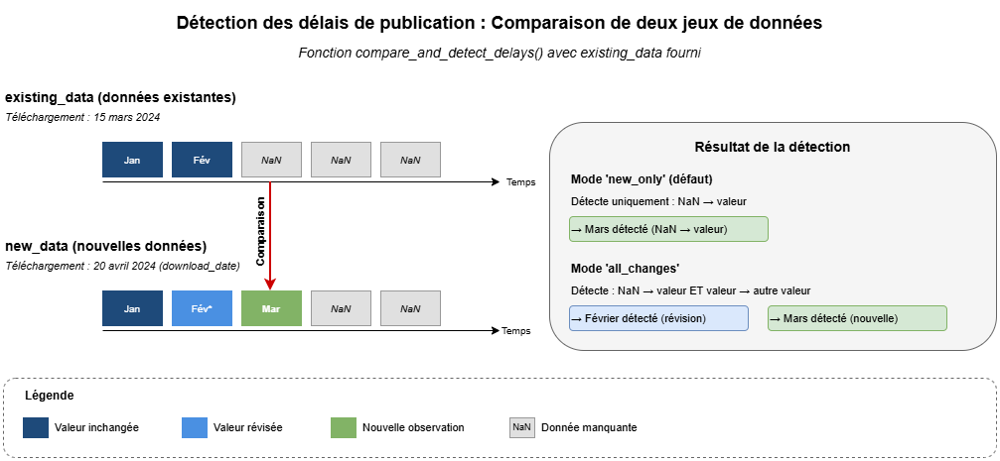
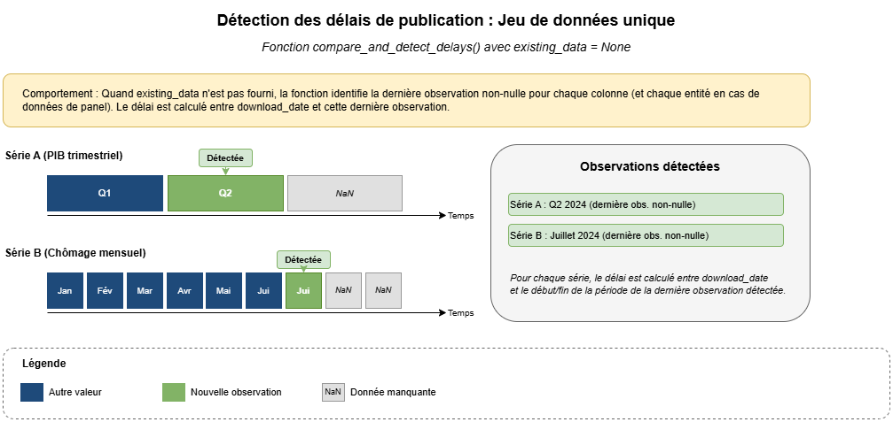
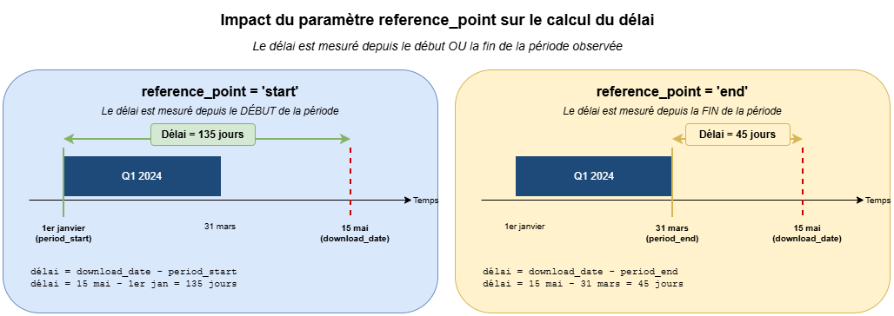
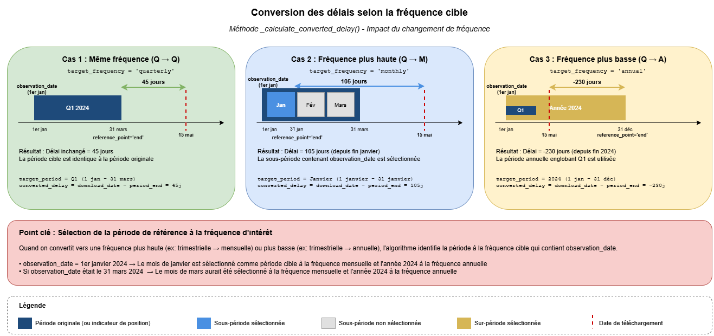
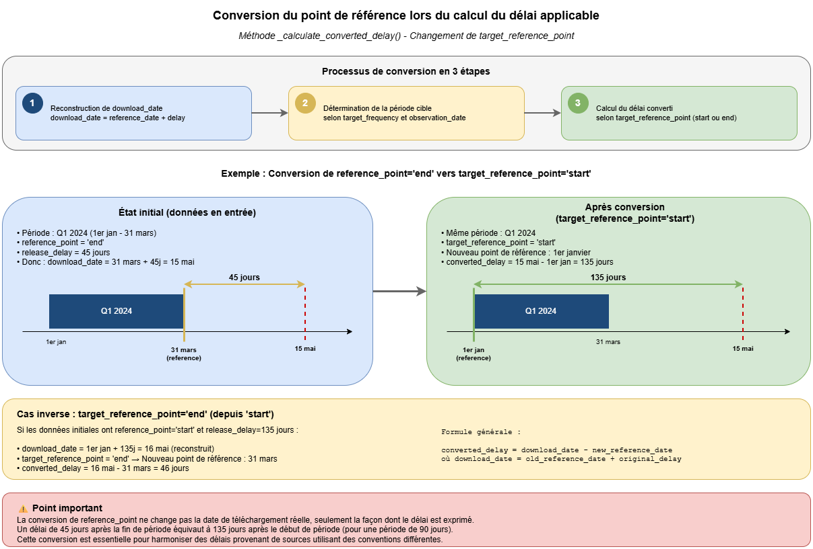

# Tutoriel : Traitement des délais de publication en prévision

## Introduction

Les **délais de publication** (ou *publication delays*) des variables utilisées pour construire un modèle de prévision sur séries temporelles constituent un écueil dont il faut tenir compte pour simuler justement la performance prédictive de modèles en production. En pratique, les données économiques, financières ou opérationnelles ne sont en effet pas disponibles instantanément : elles sont publiées avec un retard qui peut aller de quelques jours à plusieurs mois. Ignorer ces délais lors de l'entraînement et de l'évaluation des modèles conduit à une surestimation systématique des performances.

Ce tutoriel présente deux approches complémentaires pour gérer ces délais : la **conservation de l'acquis** et le **décalage des séries**.

## 1. Comprendre les délais de publication

### 1.1 Qu'est-ce qu'un délai de publication ?

Le délai de publication est le temps qui s'écoule entre :
- La fin de la période de référence d'une observation
- Le moment où cette observation devient disponible

**Exemples** :
- Le PIB du T1 2024 (janvier-mars) est publié fin avril → délai de ~30 jours
- Les ventes d'un magasin du 15 janvier sont consolidées le 18 janvier → délai de 3 jours
- Le taux de chômage de septembre est publié début octobre → délai de ~7 jours

### 1.2 Impact sur la prévision

Au moment de faire une prévision à la date $t$, nous disposons uniquement des observations publiées avant $t$. Pour une série avec un délai de publication $d$ :

- **Dernière observation disponible** : $y_{t-d}$
- **Observations non disponibles** : $y_{t-d+1}, ..., y_{t-1}, y_t$


**Conséquence** : Si nous entraînons un modèle sur des données sans tenir compte des délais, nous créons un **data leakage temporel** en utilisant des informations qui ne seraient pas disponibles en production.

## 2. Deux approches pour gérer les délais

### 2.1 Vue d'ensemble

Il existe deux stratégies principales pour gérer les délais de publication, chacune avec ses avantages :

| Approche | Principe | Avantages | Cas d'usage |
|----------|----------|-----------|-------------|
| **Conservation de l'acquis** | Masquer les observations non disponibles | Préserve l'alignement temporel | Absence d'effets d'entraînement, seules les informations de la période en cours sont pertinentes |
| **Décalage des séries** | Shifter les séries selon leur délai | Utilise toute l'information disponible | Effets d'entraînement, réalisation d'une prévision en début de période |

### 2.2 Approche 1 : Conservation de l'acquis (strategy `mask`)

**Principe** : On conserve l'alignement temporel original mais on remplace par `NaN` les observations qui ne seraient pas encore disponibles au moment de la prévision.


**Algorithme** :
```
Pour chaque série x_i avec délai d_i :
    Pour chaque date t dans les données :
        Si t > date_prédiction - d_i :
            Masquer x_i(t)  # Remplacer par NaN
```

**Exemple pratique** :
```python
import pandas as pd
import numpy as np
from tsforecast.delays import PublicationDelayTransformer

# Données avec deux indicateurs
dates = pd.date_range('2024-01-01', periods=100, freq='D')
data = pd.DataFrame({
    'date': dates,
    'GDP': np.random.randn(100),      # Délai: 30 jours
    'inflation': np.random.randn(100)  # Délai: 7 jours
})

# Configuration des délais
delays = {'GDP': 30, 'inflation': 7}

# Application du masquage
transformer = PublicationDelayTransformer(
    delays=delays,
    strategy='mask',
    prediction_date='2024-03-15',  # Date de référence
)

# Transformation
data_masked = transformer.fit_transform(data)

# Résultat :
# - GDP : masqué après 2024-02-14 (30 jours avant 2024-03-15)
# - inflation : masqué après 2024-03-08 (7 jours avant 2024-03-15)
```

**Avantages** :
- ✅ Alignement temporel préservé : `X_t` correspond toujours à la date `t`
- ✅ Simulation réaliste en production
- ✅ Facile à inverser

**Inconvénients** :
- ❌ Perte d'information (observations masquées)
- ❌ Nécessite des modèles robustes aux valeurs manquantes

### 2.3 Approche 2 : Décalage des séries (strategy `shift`)

**Principe** : On décale chaque série vers le futur selon son délai de publication, de sorte que la valeur disponible à la date `t` soit alignée avec cette date.


**Algorithme** :
```
Pour chaque série x_i avec délai d_i :
    Shifter la série de d_i périodes vers le futur
    # x_i(t+d_i) ← x_i(t)
```

**Exemple pratique** :
```python
# Même configuration que précédemment
transformer = PublicationDelayTransformer(
    delays=delays,
    strategy='shift',  # Mode décalage
    prediction_date='2024-03-15'
)

# Transformation
data_shifted = transformer.fit_transform(data)

# Résultat :
# - GDP de date t apparaît maintenant à t+30 jours
# - inflation de date t apparaît à t+7 jours
# → Les valeurs à la ligne du 15 mars sont celles publiées ce jour-là
```

**Avantages** :
- ✅ Aucune perte d'information
- ✅ Utilise la dernière observation disponible
- ✅ Pas de valeurs manquantes générées
- ✅ Permet de tenir compte des effets d'entraînement

**Inconvénients** :
- ❌ Perd l'alignement temporel naturel
- ❌ Interprétation moins intuitive

## 3. Comparaison visuelle des deux approches

### 3.1 Données brutes avant transformation

Supposons deux séries avec des délais différents :
- Série A (bleu foncé) : délai de 5 jours
- Série B (bleu clair) : délai de 15 jours

### 3.2 Après application de la stratégie `mask`

Les observations trop récentes sont masquées (remplacées par NaN). L'alignement temporel est préservé mais certaines cellules deviennent vides.

### 3.3 Après application de la stratégie `shift`

Les séries sont décalées vers le futur. Aucune observation n'est perdue, mais les valeurs ne correspondent plus à leur date de référence originale.


## 4. Détails de l'implémentation

Cette section décrit en profondeur les trois composants clés du module de gestion des délais de publication : la fonction de détection `compare_and_detect_delays`, la fonction de calcul `calculate_applicable_delay`, et le transformeur `PublicationDelayTransformer`.

### 4.1 Détection des délais : `compare_and_detect_delays`

La fonction `compare_and_detect_delays` identifie les nouvelles observations et calcule leurs délais de publication en comparant deux jeux de données ou en analysant les valeurs manquantes d'un seul jeu de données par rapport à une date.

#### 4.1.1 Signature et arguments

```python
from tsforecast.delays import compare_and_detect_delays

df_delays = compare_and_detect_delays(
    new_data: pd.DataFrame,
    existing_data: Optional[pd.DataFrame] = None,
    download_date: Union[str, datetime] = None,
    detection_mode: str = 'new_only',
    reference_point: str = 'start',
    delay_unit: Literal['us', 's', 'D', 'microsecond', 'second', 'day'] = 'day',
    time_col: Optional[str] = None,
    panel_cols: Optional[List[str]] = None
)
```

| Argument | Type | Description |
|----------|------|-------------|
| `new_data` | `pd.DataFrame` | Nouveau jeu de données à analyser. L'index doit contenir les dates (ou un MultiIndex pour les données panel). |
| `existing_data` | `pd.DataFrame` ou `None` | Jeu de données existant pour comparaison. Si `None`, identifie l'observation non nulle la plus récente par variable. |
| `download_date` | `str` ou `datetime` | Date de téléchargement des données. Si `None`, utilise `datetime.now()`. |
| `detection_mode` | `'new_only'` ou `'all_changes'` | Mode de détection : `'new_only'` détecte uniquement les transitions NaN→valeur, `'all_changes'` détecte aussi les révisions. |
| `reference_point` | `'start'` ou `'end'` | Point de référence pour le calcul du délai : début ou fin de la période. |
| `delay_unit` | `str` | Unité du délai retourné : `'day'`/`'D'`, `'second'`/`'s'`, ou `'microsecond'`/`'us'`. |
| `time_col` | `str` ou `None` | Nom de la colonne temporelle (si non présente dans l'index). |
| `panel_cols` | `List[str]` ou `None` | Liste des colonnes identifiant les entités panel (si non présentes dans l'index). |

#### 4.1.2 Valeur retournée

La fonction retourne un `DataFrame` indexé par les dates (et entités pour les données panel), avec les colonnes suivantes :

| Colonne | Description |
|---------|-------------|
| `observation_date` | Date de l'observation détectée |
| `column` | Nom de la variable concernée |
| `download_date` | Date de téléchargement des données à partir de laquelle est calculé le délai |
| `frequency` | Fréquence détectée de la série (`'M'`, `'Q'`, `'A'`, etc.) |
| `period_start` | Date de début de la période de référence de l'observation à la fréquence détectée |
| `period_end` | Date de fin de la période de référence de l'observation à la fréquence détectée |
| `reference_point` | Point de référence utilisé (`'start'` ou `'end'`) |
| `release_delay` | Délai de publication calculé (arrondi à l'entier supérieur) entre le point de référence de la période de l'observation et la date de téléchargement |
| `unit` | Unité du délai (`'day'`, `'second'`, `'microsecond'`) |

#### 4.1.3 Cas d'usage 1 : Comparaison de deux jeux de données

Lorsque `existing_data` est fourni, la fonction compare les deux jeux de données pour identifier les changements.



```python
import pandas as pd
from datetime import datetime
from tsforecast.delays import compare_and_detect_delays

# Données existantes (téléchargées le 15 mars 2024)
existing_data = pd.DataFrame({
    'GDP': [1.2, 1.5, np.nan, np.nan]
}, index=pd.to_datetime(['2023-04-01', '2023-07-01', '2023-10-01', '2024-01-01']))
existing_data.index.freq = 'QS'

# Nouvelles données (téléchargées le 20 avril 2024)
new_data = pd.DataFrame({
    'GDP': [1.2, 1.6, 1.8, 2.1]  # Q3 révisé, Q4 et Q1 nouveaux
}, index=pd.to_datetime(['2023-04-01', '2023-07-01', '2023-10-01', '2024-01-01']))
new_data.index.freq = 'QS'

# Mode 'new_only' : détecte uniquement NaN → valeur
df_new_only = compare_and_detect_delays(
    new_data=new_data,
    existing_data=existing_data,
    download_date='2024-04-20',
    detection_mode='new_only',
    reference_point='end'
)
# Résultat : Q4 2023 et Q1 2024 détectés

# Mode 'all_changes' : détecte aussi les révisions
df_all_changes = compare_and_detect_delays(
    new_data=new_data,
    existing_data=existing_data,
    download_date='2024-04-20',
    detection_mode='all_changes',
    reference_point='end'
)
# Résultat : Q3 2023 (révision), Q4 2023 et Q1 2024 détectés
```

#### 4.1.4 Cas d'usage 2 : Analyse d'un jeu de données unique

Lorsque `existing_data=None`, la fonction identifie l'observation non-nulle la plus récente pour chaque variable (et chaque entité en données panel).



```python
# Identification des dernières observations disponibles
df_delays = compare_and_detect_delays(
    new_data=new_data,
    existing_data=None,  # Pas de données existantes
    download_date='2024-04-20',
    reference_point='end'
)
# Résultat : dernière observation non-NaN par colonne
```

Ce mode est utile pour :
- L'initialisation d'un système de suivi des délais
- L'estimation des délais à partir d'un snapshot
- La calibration sans historique de versions

#### 4.1.5 Impact du paramètre `reference_point`

Le choix du point de référence affecte significativement la valeur du délai calculé.



| `reference_point` | Formule |
|-------------------|---------|
| `'start'` | `delay = download_date - period_start` |
| `'end'` | `delay = download_date - period_end` |

```python
# Exemple : Q1 2024 (1er jan - 31 mars), téléchargé le 15 mai 2024

# Avec reference_point='start'
# delay = 15 mai - 1er jan = 135 jours

# Avec reference_point='end'
# delay = 15 mai - 31 mars = 45 jours
```

---

### 4.2 Calcul des délais applicables : `calculate_applicable_delay`

La fonction `calculate_applicable_delay` convertit les délais détectés vers une fréquence et un point de référence cibles, puis les agrège pour obtenir un délai applicable par indicateur.

#### 4.2.1 Signature et arguments

```python
from tsforecast.delays import calculate_applicable_delay

df_applicable = calculate_applicable_delay(
    publication_delays: pd.DataFrame,
    target_reference_point: Literal['start', 'end'],
    target_frequency: Union[str, Dict[str, str]],
    target_unit: Optional[Literal['us', 's', 'D', 'microsecond', 'second', 'day']] = None
    indicators: Optional[List[str]] = None,
    aggregate_by_panel: bool = False,
    aggregation_method: Union[str, callable] = 'median'
)
```

| Argument | Type | Description |
|----------|------|-------------|
| `publication_delays` | `pd.DataFrame` | DataFrame retourné par `compare_and_detect_delays()`. |
| `target_reference_point` | `'start'` ou `'end'` | Point de référence cible pour le délai converti. |
| `target_frequency` | `str` ou `Dict` | Fréquence cible (`'M'`, `'Q'`, `'A'`, etc.) ou dictionnaire par indicateur. |
| `target_unit` | `str` ou `None` | Unité cible. Si `None`, utilise l'unité des données d'entrée. |
| `indicators` | `List[str]` ou `None` | Liste des indicateurs à traiter. Si `None`, traite tous les indicateurs. |
| `aggregate_by_panel` | `bool` | Si `True`, calcule des délais séparés par entité panel. Sinon, agrège sur toutes les entités. |
| `aggregation_method` | `str` ou `callable` | Méthode d'agrégation : `'mean'`, `'median'`, `'max'`, `'min'`, ou fonction personnalisée. |

#### 4.2.2 Valeur de retour

Le DataFrame retourné est indexé par indicateur (ou par entité et indicateur si `aggregate_by_panel=True`) :

| Colonne | Description |
|---------|-------------|
| `applicable_delay` | Délai calculé après conversion et agrégation |
| `unit` | Unité du délai |
| `target_frequency` | Fréquence cible utilisée |
| `target_reference_point` | Point de référence cible |
| `n_observations` | Nombre d'observations utilisées dans l'agrégation |
| `aggregation_method` | Méthode d'agrégation utilisée |

#### 4.2.3 Conversion de fréquence

Lors de la conversion vers une fréquence différente, la fonction identifie la sous-période pertinente en utilisant la date d'observation (`observation_date`).



**Cas de conversion vers une fréquence plus élevée** (ex: trimestriel → mensuel) :

La sous-période sélectionnée est celle qui contient `observation_date`. Par exemple, pour des données Q1 2024 avec `observation_date` au 15 mars :
- La période cible est **mars** (et non janvier ou février)
- Le délai est recalculé par rapport aux bornes de mars

```python
# Données trimestrielles avec observation_date = 15 mars
# Conversion Q → M

df_applicable = calculate_applicable_delay(
    publication_delays=df_delays,
    target_reference_point='end',
    target_frequency='M',  # Mensuel
    aggregation_method='median'
)
# La sous-période mars est sélectionnée car elle contient observation_date
```

**Cas de conversion vers une fréquence plus basse** (ex: trimestriel → annuel) :

La période englobante à la fréquence cible est utilisée.

#### 4.2.4 Conversion du point de référence

La conversion entre points de référence suit un processus en trois étapes.



1. **Reconstruction de la date de téléchargement `download_date`** : À partir du délai original et du point de référence original
2. **Détermination de la période cible** : Identification des bornes à la fréquence cible
3. **Calcul du délai converti** : Par rapport au nouveau point de référence

```python
# Conversion reference_point='end' (45 jours) → reference_point='start'

# Étape 1: download_date = period_end + 45 jours = 31 mars + 45 = 15 mai
# Étape 2: period_start (Q1) = 1er janvier
# Étape 3: converted_delay = 15 mai - 1er jan = 135 jours
```

#### 4.2.5 Exemple complet

```python
from tsforecast.delays import compare_and_detect_delays, calculate_applicable_delay

# 1. Détection des délais
df_delays = compare_and_detect_delays(
    new_data=economic_data,
    download_date='2024-04-20',
    reference_point='end'
)

# 2. Calcul des délais applicables (conversion vers mensuel, ref='start')
df_applicable = calculate_applicable_delay(
    publication_delays=df_delays,
    target_reference_point='start',
    target_frequency='M',
    target_unit='day'
    aggregation_method='median'
)

print(df_applicable)
#              applicable_delay unit target_frequency target_reference_point  n_observations aggregation_method
# column                                                                                                        
# GDP                      75.0    D                M                  start               4             median
# inflation                45.0    D                M                  start               4             median
```

---

### 4.3 Application des délais : `PublicationDelayTransformer`

Le `PublicationDelayTransformer` est un transformeur compatible avec l'API scikit-learn qui applique les délais de publication aux données selon la stratégie (`'shift'` ou `'mask'`).

#### 4.3.1 Signature et arguments

```python
from tsforecast.delays import PublicationDelayTransformer

transformer = PublicationDelayTransformer(
    delays: Union[Dict[str, float], pd.DataFrame],
    prediction_date: Union[str, datetime] = 'today',
    strategy: Union[Literal['shift', 'mask'], Dict[str, Literal['shift', 'mask']]] = 'shift',
    target_frequency: Optional[Union[str, Dict[str, str]]] = None,
    delay_unit: Optional[Union[str, Dict[str, str]]] = None,
    reference_point: Optional[Union[Literal['start', 'end'], Dict[str, Literal['start', 'end']]]] = None,
    handle_missing_delays: Literal['ignore', 'warn', 'error'] = 'warn',
    default_values: Optional[Dict[str, Union[int, float, str]]] = None
)
```

| Argument | Type | Description |
|----------|------|-------------|
| `delays` | `Dict` ou `pd.DataFrame` | Délais par variable. Si DataFrame, doit contenir les colonnes `'column'` et `'applicable_delay'`. |
| `prediction_date` | `str` ou `datetime` | Date de prédiction de référence. Accepte `'today'` pour la date courante. |
| `strategy` | `str` ou `Dict` | Stratégie d'application : `'shift'` (décalage) ou `'mask'` (masquage). Peut être spécifié par variable. |
| `target_frequency` | `str`, `Dict` ou `None` | Fréquence cible pour la stratégie `'mask'`. Ignoré pour `'shift'`. |
| `delay_unit` | `str`, `Dict` ou `None` | Unité des délais. Si `None`, inféré depuis le DataFrame. |
| `reference_point` | `str`, `Dict` ou `None` | Point de référence des délais. Si `None`, inféré depuis le DataFrame. |
| `handle_missing_delays` | `str` | Gestion des variables sans délai défini : `'ignore'`, `'warn'`, ou `'error'`. |
| `default_values` | `Dict` ou `None` | Valeurs par défaut pour les variables sans délai spécifié. |

#### 4.3.2 Attributs après `fit`

| Attribut | Description |
|----------|-------------|
| `prediction_date_` | Date de prédiction résolue (objet `datetime`) |
| `detected_frequencies_` | Dictionnaire des fréquences détectées par colonne |
| `shift_params` | Paramètres de décalage par colonne : `{'n_periods': int, 'frequency': str}` |
| `mask_params` | Paramètres de masquage par colonne : `{'n_obs': int, 'mask_frequency': str, 'how': str}` |
| `auxiliary_transformers_` | Transformeurs auxiliaires stockés pour `inverse_transform` |

#### 4.3.3 Calcul du nombre de périodes à décaler (stratégie `'shift'`)

Le cœur de la stratégie `'shift'` est le calcul du nombre de périodes à décaler pour chaque série.


**Formule :**

$$n\_periods = -\lceil \frac{delay - elapsed\_adj}{period\_duration} \rceil$$

Où :
- `delay` : délai de publication de la série
- `elapsed_adj` : temps écoulé entre le début de la période courante et `prediction_date`, ajusté selon `reference_point`
- `period_duration` : durée d'une période à la fréquence de la série

**Ajustement selon `reference_point` :**

```python
# Si reference_point == 'end'
elapsed_adj = elapsed_duration - period_duration

# Si reference_point == 'start'
elapsed_adj = elapsed_duration
```

**Exemple détaillé :**

```python
# Configuration
prediction_date = '2024-02-15'
delay = 45  # jours
reference_point = 'end'

# Pour une série mensuelle (period_duration = 30 jours)
period_start = '2024-02-01'
elapsed_duration = 14  # jours (15 fév - 1er fév)

# Ajustement car reference_point = 'end'
elapsed_adj = 14 - 30 = -16 jours

# Calcul du nombre de périodes
n_periods = -ceil((45 - (-16)) / 30) = -ceil(61 / 30) = -ceil(2.03) = -3

# Interprétation : décaler de 3 périodes vers le passé
# → La dernière observation disponible est celle de novembre 2023
```

**Impact de la fréquence :**

| Fréquence | `period_duration` | `n_periods` calculé | Dernière observation disponible |
|-----------|-------------------|---------------------|--------------------------------|
| Mensuel (M) | 30 jours | -3 | Novembre 2023 |
| Trimestriel (Q) | 90 jours | -1 | Q4 2023 |
| Annuel (A) | 365 jours | -1 | 2023 |

#### 4.3.4 Calcul du nombre d'observations à masquer (stratégie `'mask'`)

La stratégie `'mask'` utilise la **fréquence de l'index** (pas celle de la série) pour calculer le nombre d'observations à masquer.


**Formule :**

$$n\_periods = \lceil \frac{delay - elapsed\_adj}{index\_period\_duration} \rceil$$

**Différence clé avec `'shift'` :**

- `'shift'` utilise `period_duration` (fréquence de la série)
- `'mask'` utilise `index_period_duration` (fréquence de l'index)

Cette distinction est cruciale pour les données à fréquences mixtes où l'index peut être plus fin que certaines séries.

**Vérification de faisabilité (`can_mask`) :**

Avant d'appliquer le masquage, le transformeur vérifie que l'opération ne produira pas une série entièrement NaN sur la période cible :

```python
target_period_duration = convert_duration(1, target_frequency, series_frequency)
can_mask = floor(target_period_duration) > n_periods
```

Si `can_mask = False`, la colonne est automatiquement basculée vers la stratégie `'shift'` avec un avertissement.

**Exemple :**

```python
# Configuration
prediction_date = '2024-02-15'
delay = 45  # jours
reference_point = 'end'
target_frequency = 'Q'  # Trimestriel
index_frequency = 'M'  # Index mensuel

# Calcul
index_period_duration = 30 jours
n_periods = ceil(90 / 30) = 3 mois à masquer

# Vérification can_mask
target_period_duration = 3 mois (1 trimestre = 3 mois)
can_mask = floor(3) > 3 = False

# → Masquage impossible, toutes les observations du trimestre seraient NaN
# → Bascule automatique vers 'shift'
```

#### 4.3.5 Exemple d'utilisation complète

```python
import pandas as pd
from datetime import datetime
from tsforecast.delays import (
    compare_and_detect_delays,
    calculate_applicable_delay,
    PublicationDelayTransformer
)

# 1. Création des données
dates = pd.date_range('2024-01-01', periods=100, freq='D')
data = pd.DataFrame({
    'GDP': np.random.randn(100),
    'inflation': np.random.randn(100),
    'retail_sales': np.random.randn(100)
}, index=dates)

# 2. Définition des délais (méthode directe)
delays = {'GDP': 45, 'inflation': 30, 'retail_sales': 20}

# 3a. Stratégie 'shift' : décalage des séries
transformer_shift = PublicationDelayTransformer(
    delays=delays,
    strategy='shift',
    prediction_date='2024-03-15',
    delay_unit='D',
    reference_point='end'
)

data_shifted = transformer_shift.fit_transform(data)

# Vérification des paramètres calculés
print(transformer_shift.shift_params)
# {'GDP': {'n_periods': -2, 'frequency': 'D'},
#  'inflation': {'n_periods': -1, 'frequency': 'D'},
#  'retail_sales': {'n_periods': -1, 'frequency': 'D'}}

# 3b. Stratégie 'mask' : masquage des observations récentes
transformer_mask = PublicationDelayTransformer(
    delays=delays,
    strategy='mask',
    prediction_date='2024-03-15',
    delay_unit='D',
    reference_point='end',
    target_frequency='M'
)

data_masked = transformer_mask.fit_transform(data)

# Vérification des paramètres calculés
print(transformer_mask.mask_params)
# {'GDP': {'n_obs': 45, 'mask_frequency': 'M', 'how': 'last'},
#  'inflation': {'n_obs': 30, 'mask_frequency': 'M', 'how': 'last'},
#  'retail_sales': {'n_obs': 20, 'mask_frequency': 'M', 'how': 'last'}}

# 4. Transformation inverse
data_original = transformer_shift.inverse_transform(data_shifted)
```

#### 4.3.6 Utilisation avec le DataFrame de délais

Le transformeur peut également recevoir directement le DataFrame retourné par `calculate_applicable_delay`, ce qui permet l'inférence automatique des paramètres :

```python
# Pipeline complet avec inférence des paramètres
df_delays = compare_and_detect_delays(
    new_data=data,
    download_date='2024-03-20',
    reference_point='end'
)

df_applicable = calculate_applicable_delay(
    publication_delays=df_delays,
    target_reference_point='end',
    target_frequency='M',
    aggregation_method='median'
)

# Le transformer infère delay_unit, reference_point et target_frequency
transformer = PublicationDelayTransformer(
    delays=df_applicable,  # DataFrame avec métadonnées
    strategy='mask',
    prediction_date='2024-03-15'
    # delay_unit, reference_point, target_frequency inférés automatiquement
)

data_transformed = transformer.fit_transform(data)
```

#### 4.3.7 Stratégies mixtes par variable

Il est possible de spécifier une stratégie différente pour chaque variable :

```python
transformer = PublicationDelayTransformer(
    delays=delays,
    strategy={
        'GDP': 'mask',          # Masquage pour le PIB
        'inflation': 'shift',   # Décalage pour l'inflation
        'retail_sales': 'mask'  # Masquage pour les ventes
    },
    prediction_date='2024-03-15',
    delay_unit='D',
    reference_point='end',
    target_frequency='M'
)
```

## 5. Utilisation pratique dans un pipeline de prédiction

### 5.1 Pipeline complet

```python
# Importation des modules
from sklearn.pipeline import Pipeline
from sklearn.ensemble import RandomForestRegressor
from tsforecast.delays import PublicationDelayTransformer

# Définition des délais (en jours)
delays = {
    'GDP': 45,
    'CPI': 30,
    'unemployment': 15,
    'retail_sales': 20
}

# Construction du pipeline
pipeline = Pipeline([
    ('delays', PublicationDelayTransformer(
        delays=delays,
        strategy='mask',
        prediction_date='today'
    )),
    ('model', RandomForestRegressor(n_estimators=100))
])

# Entraînement
pipeline.fit(X_train, y_train)

# Prédiction (les délais sont automatiquement appliqués)
y_pred = pipeline.predict(X_test)
```

### 5.2 Validation croisée réaliste

Pour une évaluation réaliste, il faut combiner la gestion des délais avec un découpage temporel correct :

```python
# Importation des modules
from tsforecast.crossvals import TSOutOfSampleSplit

# Configuration de la validation croisée
splitter = TSOutOfSampleSplit(
    n_splits=5,
    test_size=30,
    gap=5  # Horizon de prévision
)

# Évaluation avec délais
results = []
for train_idx, test_idx in splitter.split(X):
    X_train = X.iloc[train_idx]
    X_test = X.iloc[test_idx]
    
    # Application des délais uniquement sur l'ensemble de test
    transformer = PublicationDelayTransformer(
        delays=delays,
        strategy='mask',
        prediction_date=X_test['date'].iloc[0],  # Date du début du test
        time_col='date'
    )
    
    X_test_delayed = transformer.fit_transform(X_test)
    
    # Entraînement et évaluation
    model = RandomForestRegressor()
    model.fit(X_train, y_train)
    y_pred = model.predict(X_test_delayed)
    
    results.append(evaluate_predictions(y_test, y_pred))
```

## 6. Cas d'usage avancés

### 6.1 Délais variables par entité (données de panel)

Pour les données de panel, chaque entité peut avoir des délais différents. On utilise `PanelwiseTransformer` alors avec les fonctions helper pour appliquer les délais adéquats à chaque entité grâce à un `PublicationDelayTransformer` différent :

**Méthode 1 : Factory pattern avec `create_delay_transformer_factory`**

```python
from tsforecast.delays import (
    PublicationDelayTransformer,
    compare_and_detect_delays,
    calculate_applicable_delay,
    create_delay_transformer_factory
)
from tsforecast.panel import PanelwiseTransformer

# 1. Détection des délais par entité
df_delays = compare_and_detect_delays(
    new_data=panel_data,
    download_date='2024-03-15',
    panel_cols=['country']
)

# 2. Calcul des délais applicables par entité
df_applicable = calculate_applicable_delay(
    publication_delays=df_delays,
    target_reference_point='end',
    target_frequency='M',
    aggregate_by_panel=True  # Agrège par entité
)

# 3. Création de la factory
factory = create_delay_transformer_factory(
    df_delays=df_applicable,
    strategy='mask',
    prediction_date='2024-03-15'
)

# 4. Application avec PanelwiseTransformer
panel_transformer = PanelwiseTransformer(
    transformer=factory,
    panel_cols=['country']
)

data_transformed = panel_transformer.fit_transform(panel_data)
```

**Méthode 2 : entity_kwargs avec `prepare_entity_kwargs_from_delays`**

```python
from tsforecast.delays import prepare_entity_kwargs_from_delays

# Préparation des kwargs par entité
entity_kwargs = prepare_entity_kwargs_from_delays(
    df_delays=df_applicable,
    strategy='shift'
)

# Application avec un transformer de base
panel_transformer = PanelwiseTransformer(
    transformer=PublicationDelayTransformer(
        delays={},  # Sera remplacé par entity_kwargs
        prediction_date='2024-03-15'
    ),
    entity_kwargs=entity_kwargs,
    panel_cols=['country']
)

data_transformed = panel_transformer.fit_transform(panel_data)
```


## 7. Erreurs courantes à éviter

### ❌ Erreur 1 : Ignorer les délais lors de l'évaluation

```python
# INCORRECT : Évalue sans tenir compte des délais
model.fit(X_train, y_train)
score = model.score(X_test, y_test)  # Surestimation !
```

✅ **Correction** :
```python
# CORRECT : Applique les délais avant l'évaluation
transformer = PublicationDelayTransformer(delays=delays, strategy='mask')
X_test_real = transformer.fit_transform(X_test)
score = model.score(X_test_real, y_test)
```

### ❌ Erreur 2 : Confusion entre délai et horizon

```python
# INCORRECT : Confond délai de publication et horizon de prévision
gap = horizon  # ⚠️ Incomplet !
```

✅ **Correction** :
```python
# CORRECT : Prend en compte les deux
gap = horizon + max_publication_delay
```

## 8. Conclusion

La gestion rigoureuse des délais de publication est essentielle pour :

1. **Obtenir des évaluations réalistes** : Éviter la surestimation des performances
2. **Déployer des modèles fonctionnels** : Simuler les vraies conditions de production

**Ressources complémentaires** :
- Documentation de `tsforecast.delays`
- Tutoriel sur la validation croisée temporelle